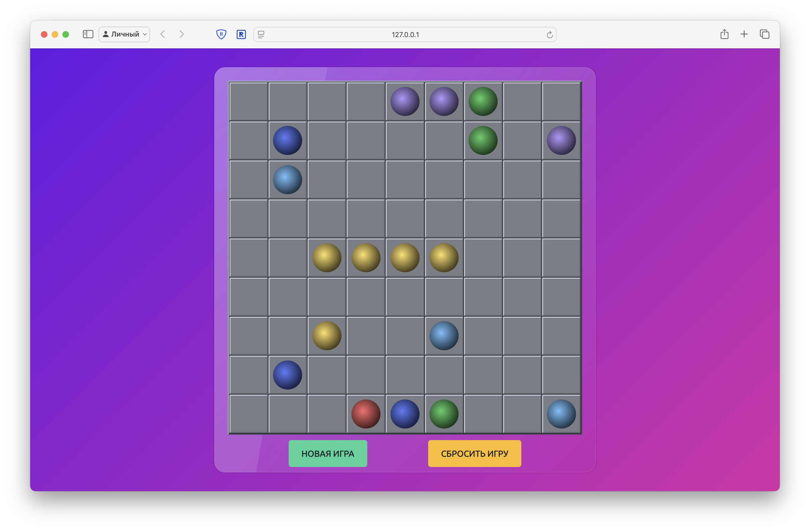

# Color Lines

Попытка реализовать классическую игру Color Lines на чистом HTML, CSS и JavaScript.

Одна из основных идей – использовать только CSS для оформления и эффектов, без изображений.

На текущий момент не определяются диагональные линии и не подсчитываются баллы за игру.

## Ссылки на использованные при разработке материалы

- Bounce animation
  - https://www.youtube.com/watch?v=drsUJIBKdXk
- Ball 3D effect
  - https://cssanimation.rocks/spheres/
  - https://dev.to/ryandsouza13/creating-a-fake-3d-effect-in-css-using-a-single-div-17a
- Ball moving (with pathfinding)
  - https://briangrinstead.com/blog/astar-search-algorithm-in-javascript/
  - https://dev.to/codesphere/pathfinding-with-javascript-the-a-algorithm-3jlb
